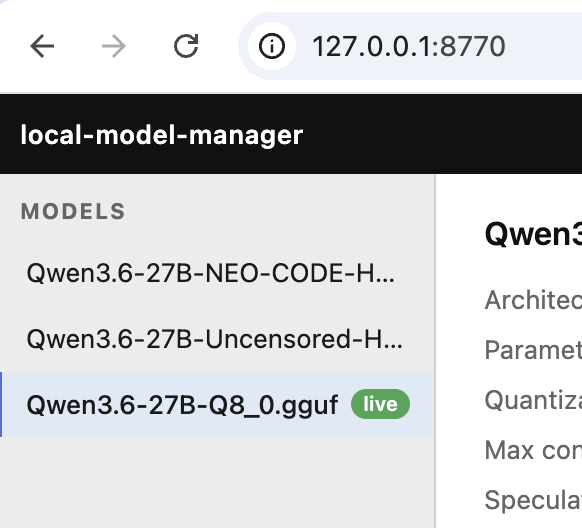
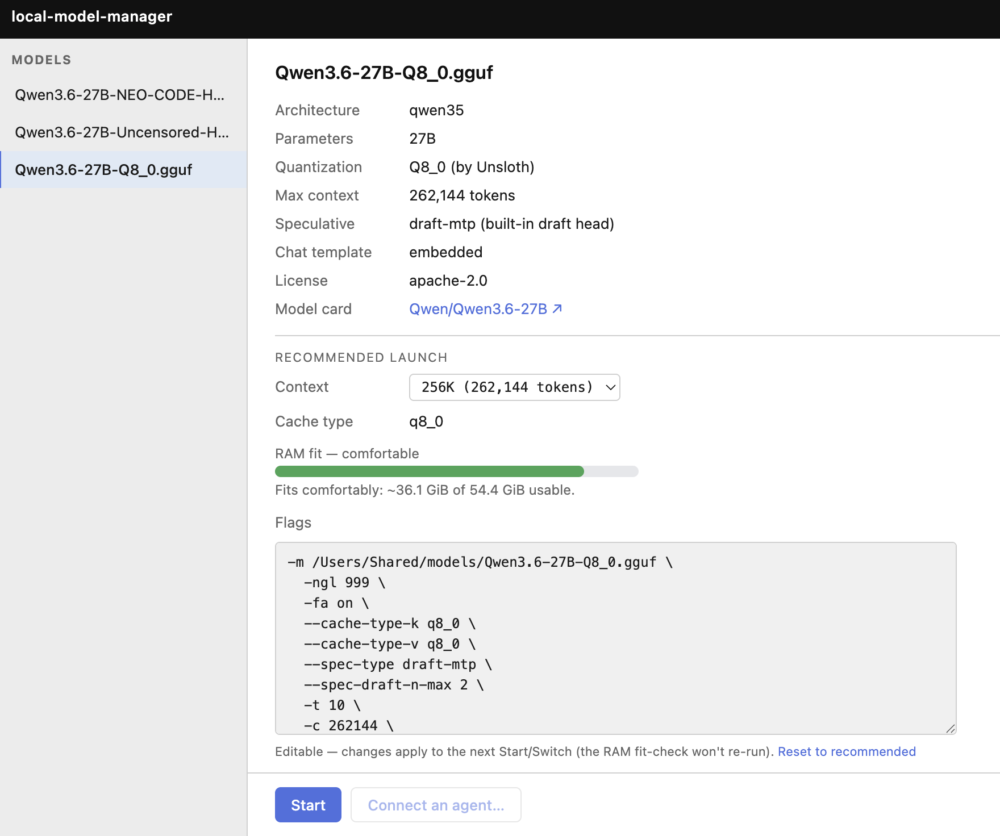
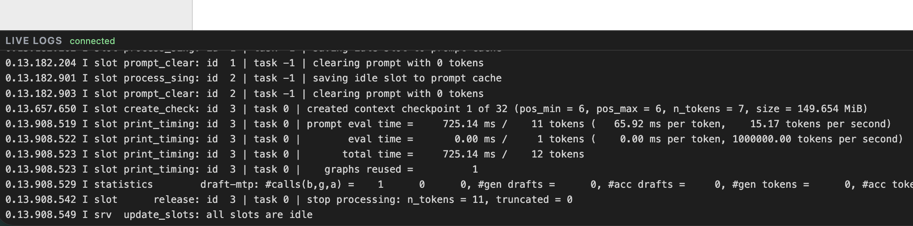
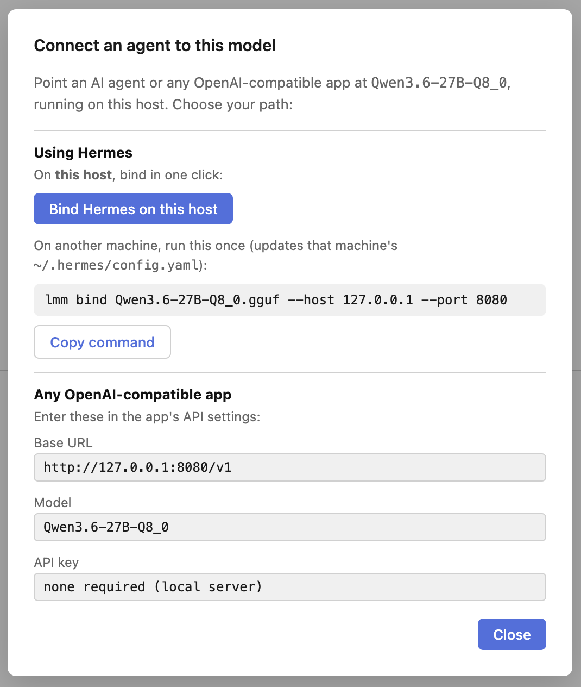

# local-model-manager (`lmm`)

A **lean manager for local [llama.cpp](https://github.com/ggml-org/llama.cpp) models** — discover what's on disk, launch each with a hardware-tuned config, switch between them from a web UI, and point your agent at whichever one is running. **Built for people running [Hermes](https://hermes-agent.nousresearch.com/) (or any OpenAI-compatible agent) against their own hardware** — without the weight of Ollama or LM Studio.

`lmm` is deliberately small: it manages the `llama-server` instances you already run, rather than bundling its own model runtime, registry, or chat UI. If you have llama.cpp, your GGUF files, and an agent, `lmm` is the thin layer that ties them together.

`lmm` lets you:

- **Discover** every local model on disk, classified from its GGUF header (not from file names).
- Get a **recommended `llama-server` config** for any model — computed from the GGUF metadata *and* the machine's hardware (cores, usable RAM, Metal/GPU), with a **fit-check** that warns when a model won't comfortably fit in RAM and names the culprit.
- **Start / stop / switch** the running model from a **web UI** or the CLI.
- **Connect an agent** ([Hermes](https://hermes-agent.nousresearch.com/), or any OpenAI-compatible app) to the running model — one click on the host.
- Run as an always-on **system service** with a token-gated HTTP control plane, drivable from any machine on your LAN.

**The Hermes connection.** "Connect an agent" repoints Hermes at the running model — it registers your local server as a custom OpenAI-compatible provider and sets it as Hermes's default, so your agent talks to your local model and follows along when you switch. One click on the host; a single `lmm bind` from any other machine. (Any OpenAI-compatible app works too — the UI shows the base URL and model id to paste.)

> **⚠️ `lmm` must run on the same machine as llama.cpp and your models.** The daemon spawns and supervises `llama-server` and reads the GGUF files off local disk, so it has to live on the model host — it cannot be pointed at a remote llama.cpp. Browsers, the `lmm` CLI in client mode, and agents can run on *any* LAN machine; only the daemon is pinned to the host. See [How it runs](#how-it-runs-topology).

> **Status:** backend, CLI, daemon, and web UI are implemented and tested. Interfaces are pre-1.0 and may change. See [ARCHITECTURE.md](ARCHITECTURE.md) and [ROADMAP.md](ROADMAP.md).

---

## Install

Run everything below **on the machine that holds your model files and will run llama.cpp** — `lmm` has to live there (see the co-location note above).

### 1. Prerequisites

**[`uv`](https://github.com/astral-sh/uv)** — manages Python ≥ 3.11 for you:

```bash
curl -LsSf https://astral.sh/uv/install.sh | sh
```

**llama.cpp** — provides `llama-server`, which must be on your `PATH`. If you don't already have it, the simplest route on macOS is [Homebrew](https://brew.sh):

```bash
brew install llama.cpp
```

On other platforms install llama.cpp any way you like (package manager or [build from source](https://github.com/ggml-org/llama.cpp)); `lmm` only needs the `llama-server` binary on your `PATH`.

### 2. Get `lmm`

```bash
git clone https://github.com/mdorf/local-model-manager.git
cd local-model-manager
uv tool install . --compile-bytecode     # installs the `lmm` command onto your PATH
```

Confirm it's available — this should print the help:

```bash
lmm --help
```

> If `lmm` isn't found, `uv`'s tool directory isn't on your `PATH`. Run `uv tool update-shell`, then open a new terminal.
>
> **Why `--compile-bytecode`?** It pre-compiles the `.pyc` caches now (owned by you). Without it, the first time you run a privileged `sudo lmm …` command, Python would write those caches **as root** into your tool directory — which then blocks later `uv tool install --force`. Pre-compiling avoids that. (To reinstall the command later, use `uv tool install . --force --compile-bytecode`.)

**These two steps (clone + `uv tool install .`) are the shared foundation for both ways of running the daemon below.** Foreground and always-on are *alternatives* — pick one; the clone can stay where it is, the installed service builds its own copy.

---

## Run the daemon

Choose **one** of the two modes.

### Option A — Foreground (try it out)

Runs in your terminal; stops when you close it. No `sudo`, no system changes — ideal for a first look.

```bash
lmm daemon                                   # models in ~/models
LMM_MODELS_DIR=/path/to/models lmm daemon     # or point it elsewhere (persisted after first run)
```

Then open the web UI:

**→ http://127.0.0.1:8770**

**To stop:** press **Ctrl-C** in that terminal. (That stops the *daemon*. Any model you started keeps running — stop it with the **Stop** button in the UI, or `lmm stop`.)

### Option B — Always-on service (survives logout & reboot)

Installs the daemon as a launchd `LaunchDaemon`: it starts at boot, restarts on crash, and **runs as you**. macOS only for now (a Linux/systemd installer is on the roadmap).

Run this **from inside your clone** — `--project-dir "$(pwd)"` tells the installer where to build the daemon's copy from.

> **Why `sudo "$(command -v lmm)"` and not just `sudo lmm`?** `sudo` resets `PATH` to a minimal system default, so it can't find `lmm` (which lives in `~/.local/bin`). `$(command -v lmm)` is expanded by *your* shell first, handing `sudo` the absolute path. The installer then locates `uv`/`llama-server` for you. (If those live somewhere non-standard, fall back to `sudo env "PATH=$HOME/.local/bin:/opt/homebrew/bin:$PATH" lmm install …`.)

```bash
sudo "$(command -v lmm)" install --project-dir "$(pwd)" --models-dir /path/to/models
```

```bash
# preview the exact privileged steps without changing anything:
sudo "$(command -v lmm)" install --dry-run --project-dir "$(pwd)"

# rebuild in place later — also from the clone (keeps your token + state):
sudo "$(command -v lmm)" install --reinstall --project-dir "$(pwd)"
```

The UI is then at **http://127.0.0.1:8770**, with no terminal attached.

**Manage the service:**

```bash
lmm service status                       # installed? responding?  (read-only — no sudo)
sudo "$(command -v lmm)" service stop     # stop it (reloads on next boot)
sudo "$(command -v lmm)" service start    # (re)load it
sudo "$(command -v lmm)" service restart
```

**To stop the daemon:** `sudo "$(command -v lmm)" service stop`. Stopping or restarting the service leaves any running **model up** — only the control plane bounces, and it re-adopts the model on restart. To stop the *model* itself, use the UI **Stop** button or `lmm stop`.

---

## Using the web UI

Open **http://127.0.0.1:8770**. On the local host the daemon injects its auth token automatically, so it just loads.



Pick a model in the sidebar to see its **recommended config** and **RAM fit-check**. You can change the context length, edit the launch flags, then **Start** it.



Once a model is running, watch its live logs in the drawer, and use **Switch** to change models or **Stop** to unload.



Click **Connect an agent** to point Hermes at the running model in one click (host only), or copy the OpenAI-compatible base URL + model id to use from any other app.



---

## Uninstall (complete removal)

These steps remove **everything** `lmm` creates — service, CLI, state, and the Hermes binding — leaving the machine as if it were never installed. (`lmm` only ever *reads* your model files, so they're never touched.) Run them in order; steps 1–2 use `lmm`, so do them before step 4 removes it.

```bash
# 1. Revert the Hermes binding (restores your pre-bind config and deletes the
#    backup). A no-op if you never connected an agent.
lmm unbind

# 2. Remove the always-on service — LaunchDaemon, shared state (token/venv/logs),
#    the /Library/Logs dir, and the firewall rule. Skip if you only ever ran the
#    foreground daemon (it installs nothing).
sudo "$(command -v lmm)" uninstall

# 3. Remove foreground/dev-mode state — only exists if you ran `lmm daemon` directly.
rm -rf "$HOME/Library/Application Support/local-model-manager"

# 4. Remove the `lmm` command.
uv tool uninstall local-model-manager

# 5. Remove the cloned source (and its build venv).
rm -rf <path-to-your-clone>
```

After these steps, nothing of `lmm` remains on the machine.

---

## How it runs (topology)

`lmm` is one distributable with two roles: a **host** that manages models, and **clients** that drive it.

| Component | Where it runs |
|---|---|
| **`lmm` daemon** (`:8770`) | **On the model host** — it spawns `llama-server` and reads the GGUF files, so it must live where the models are. |
| **`llama-server`** (`:8080`) | On the host, spawned by the daemon. |
| **Web UI / `lmm` client** | Any LAN machine — a browser, or `lmm` in client mode. |
| **Hermes / any agent** | Anywhere — it just needs HTTP access to the host's `:8080/v1`. |

```
                                        LAN
  ┌─────────────────┐           ┌─ Host ───────────────────────────────────┐
  │  Browser / CLI  │◀── HTTP ─▶│ lmm daemon   :8770                       │
  │     (client)    │           │      │  spawns / supervises              │
  └─────────────────┘           │      ▼                                   │
  ┌─────────────────┐           │ llama-server   :8080   (/v1)             │
  │      Hermes     │─── /v1 ──▶│      (inference)                         │
  │  (any LAN box)  │           │ models on disk — host-side only          │
  └─────────────────┘           └──────────────────────────────────────────┘
```

The daemon binds **loopback** (`127.0.0.1`) by default; pass `--host 0.0.0.0` to expose it on the LAN (see [Security](#security)).

## CLI

Everything in the UI is on the CLI too. With a daemon running, `serve` / `stop` / `status` / `switch` route through it; otherwise they act locally.

```bash
lmm models --root /path/to/models                  # list discovered models
lmm recommend Qwen3.6-27B-Q8_0 --root /path/to/models   # tuned config + fit-check

lmm serve Qwen3.6-27B-Q8_0 --root /path/to/models  # start (default :8080); waits for /health + smoke test
lmm status                                         # show managed servers
lmm switch Other-Model --root /path/to/models      # stop current, start another
lmm stop --port 8080                               # stop the model server (not the daemon)

lmm bind Qwen3.6-27B-Q8_0 --port 8080              # point ~/.hermes/config.yaml at the running model
lmm bind --host other-host.local --port 8080       # bind to a model on another host (omit model to auto-detect)
lmm unbind                                          # revert from the pre-bind backup
```

`bind` registers a custom provider and sets the default model, preserving your config's comments and other keys (reasoning models like Qwen3.6 want a generous `max_tokens` — `bind` prints a reminder).

## Control daemon (HTTP API)

The daemon serves both the web UI and a token-gated API. All endpoints require `Authorization: Bearer <token>` except `/api/health`; on loopback the UI gets the token injected, remote clients paste it once (`lmm token` prints it).

| Method & path | Purpose |
|---|---|
| `GET /api/health` | liveness (open, no auth) |
| `GET /api/models` | list discovered models |
| `GET /api/models/{name}/recommend` | recommended config + fit for a model |
| `GET /api/servers` | list running/managed servers |
| `POST /api/servers` | start a server — body `{ "model": "...", "port": 8080 }` |
| `POST /api/servers/switch` | switch the running model |
| `DELETE /api/servers/{port}` | stop the server on a port |
| `GET /api/connection-info` | base URL / model / inference key for connecting an agent |
| `POST /api/bind` | bind the host's Hermes to the running model (loopback only) |
| `GET /api/bind-status` | whether the host's Hermes points at the running model |
| `WS /api/stream` | live server logs + status (subprotocol `lmm.bearer.<token>`) |

The daemon detects an **already-running** `llama-server` on startup and reflects it in the UI; stopping or restarting the daemon does **not** stop the model. The control API is **pre-1.0 and evolving** — treat it as unstable.

## Security

The daemon runs as **your user** (so it can read your models and bind Hermes in one click) and binds **loopback by default**, which keeps it low-risk for personal use.

If you expose it to the LAN (`--host 0.0.0.0`):

- The **control plane** (`:8770`) is gated by a **shared bearer token** — it spawns processes, so the threat model is everything *else* on the network, not your trusted clients.
- The **inference plane** (`:8080`) is gated by `llama-server --api-key` (a secret distinct from the control token).
- A compromise of the network-facing daemon would carry your account's privileges — a deliberate tradeoff for one-click binding and zero-setup model access.

**One-click "Connect an agent" is loopback-only** — the daemon can only write the host's own `~/.hermes`. To connect an agent on a *different* machine, run `lmm bind --host <host> --port 8080 …` there (the UI shows the exact command).

## Development

```bash
uv run pytest -q        # run the test suite
uv run ruff check .     # lint
```

## License

[MIT](LICENSE) © 2026 Misha Dorf
